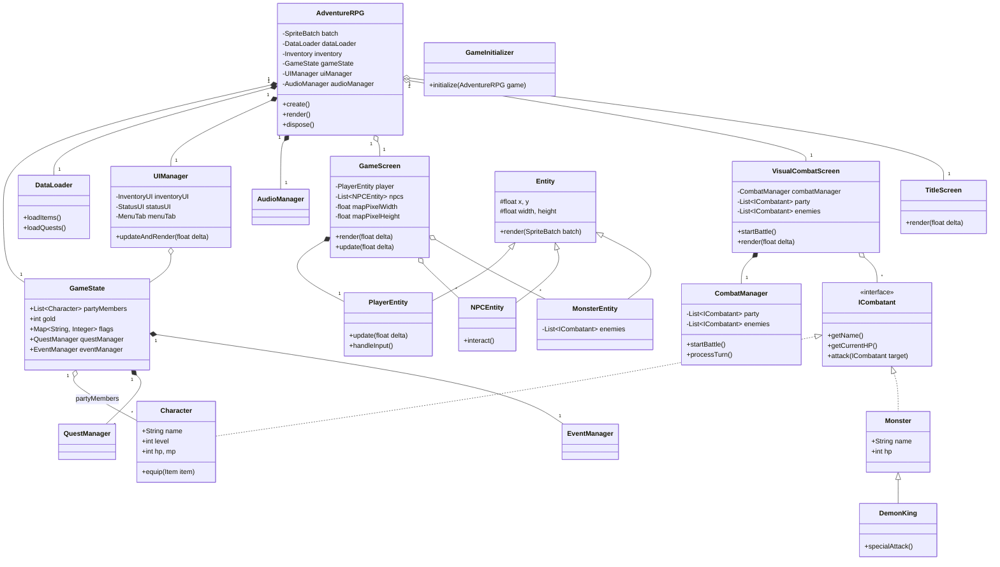

# クラス間関係図 (Class Diagram)

## 解説
- **AdventureRPG**: ゲームの中心となるクラスです。画面（Screen）の切り替えや、主要なマネージャー（UI, Audio, Data, State）を保持します。
- **GameState**: ゲームの進行状況（現在のパーティ、フラグ、クエスト状況など）を一元管理します。
- **GameScreen**: ワールドマップ探索画面を担当します。プレイヤーやNPC、敵シンボル（Entity）の更新・描画を行います。
- **Entity**: マップ上のオブジェクトの基底クラスです。
- **VisualCombatScreen**: 戦闘画面を担当します。`CombatManager` を使用して戦闘のロジックを処理し、`ICombatant` インターフェースを通してキャラクターやモンスターを操作します。
- **UIManager**: インベントリやステータス画面などのオーバーレイUIを管理します。
